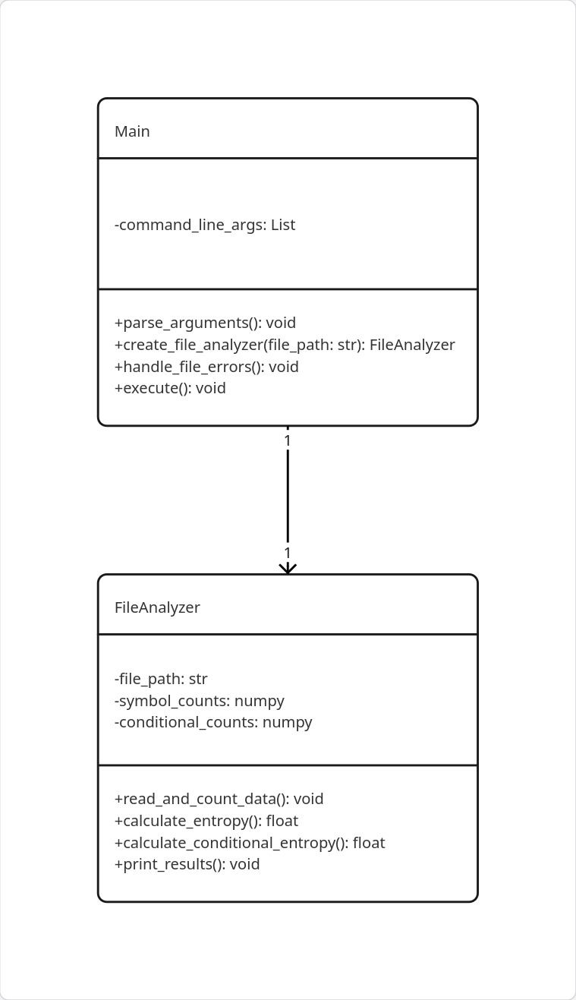

# KiKD — lab_1

A short description of the repository and the source files used in the assignment.

## Project Structure

Below is the directory tree with the most important files of the project:

```

```

### Directory Description


## UML Diagrams

